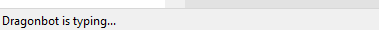

# Discord-like Typing Indicator for mIRC

A Discord-style typing indicator that shows who is currently typing in your active channel or private message, displayed at the bottom of the mIRC window using a statusbar.


_Shows "User1 is typing..." when someone is actively typing_

## Features

- **Discord-style display**: Shows "User is typing..." or "User1, User2, and User3 are typing..." for multiple users
- **Real-time updates**: Automatically updates when switching between channels/PMs
- **Smart cleanup**: Automatically removes stale typing states after 10 seconds
- **Quick toggle**: Press `F5` to enable/disable the typing indicator
- **Auto-cleanup**: Removes typing states when users part, quit, or when you close windows
- **Works in channels and PMs**: Tracks typing in both public channels and private messages

## Requirements

- **mIRC** (tested on modern versions)
- **DCX (Dialog Control Extension)** - Required for the XStatusbar functionality
- **IRC server with IRCv3 typing tags support** - The server must support the `+typing` message tag

## Installation

1. Make sure you have DCX installed and loaded in mIRC
2. Copy `typing-indicator.mrc` to your mIRC scripts folder
3. Load the script in mIRC:
   - Open mIRC
   - Press `Alt+R` to open the Scripts Editor
   - Click `File` → `Load` and select `typing-indicator.mrc`
4. The typing indicator will automatically initialize on startup

## Usage

### Commands

| Command               | Description                                    |
| --------------------- | ---------------------------------------------- |
| `F5`                  | Toggle the typing indicator on/off             |
| `/test_typing <nick>` | Test the indicator by simulating a user typing |

### How It Works

The script listens for IRCv3 `TAGMSG` messages with the `+typing` tag. When a user starts typing in your active channel or PM, their name appears in the statusbar at the bottom of the window.

**Typing states:**

- `active` - User is actively typing
- `paused` - User paused typing (still shown)
- `done` - User stopped typing (removed from display)

**Display formats:**

- Single user: `User1 is typing...`
- Multiple users: `User1, User2, and User3 are typing...`

### Automatic Behavior

- **Auto-start**: The indicator initializes automatically when mIRC starts
- **Auto-cleanup**: Typing states are removed after 10 seconds of inactivity
- **Auto-refresh**: Display updates when you switch windows
- **Auto-remove**: Clears typing states when users part, quit, or you close windows

## Testing

To test the indicator without waiting for real typing events:

```
/test_typing JohnDoe
```

This simulates JohnDoe typing in your active channel/PM.

## Troubleshooting

**Indicator not showing:**

- Make sure DCX is properly installed and loaded
- Verify your IRC server supports IRCv3 typing tags
- Check that the indicator is enabled (press `F5` to toggle)

**Typing states not clearing:**

- The script automatically cleans up states every 3 seconds
- States older than 10 seconds are automatically removed
- States are also cleared when users part/quit or you close windows

**DCX errors:**

- Ensure you have the latest version of DCX installed
- Try reloading the script with `/reload -rs typing-indicator.mrc`

## Technical Details

- **Hash table**: Uses `typing_users` hash table to track who is typing
- **Storage format**: Keys are `channel§nick` (using chr(247) as delimiter)
- **Values**: Unix timestamp of when typing started
- **Cleanup timer**: Runs every 3 seconds to purge stale entries
- **Timeout**: Typing states expire after 10 seconds

## Credits

Created for mIRC users who want a modern Discord-like typing experience in their IRC client.

## License

Free to use and modify. No warranty provided.
